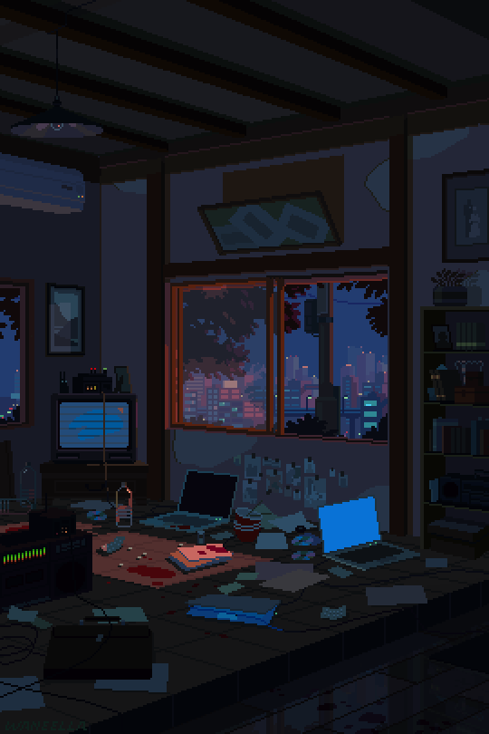

## Hey there! I'm Kurella Sai Siri Chandana 👋

  

  
  
 

## 🧠 Who Am I?

Driven by curiosity and fueled by caffeine ☕, I’m a final-year IT undergrad passionate about crafting smart solutions through code.

When I'm not chasing bugs, I'm probably:

- 📓 Doodling project ideas in the margins of my notes  
- 🔍 Deep-diving into niche tech topics no one asked about  
- 🎧 Vibing to music and curating playlists  
- 🌌 Exploring tech articles, space facts, or falling into a YouTube rabbit hole  

---
## 🌱 Currently Learning

- 🌐 Strengthening full-stack skills — one component at a time  
- ⚙️ Leveling up my DSA game in Java (and occasionally fighting off recursion nightmares)  
- 🧪 Experimenting with new dev tools and frameworks  
- 🧠 Ideating for hackathons and building impact-driven solutions  
---
## 🧩 Competitive Coding & DSA

<table>
  <tr>
    <td valign="top">

Some people unwind with Netflix. I unwind with nested loops and edge cases.  
Here’s where I sharpen my logic and occasionally overthink simple problems:

- 🧠 [LeetCode](https://leetcode.com/u/SiriChandana_K/) 
- 🚀 [GeeksforGeeks](https://www.geeksforgeeks.org/user/sirichandoo04/)
- 🐍 [HackerRank](https://www.hackerrank.com/profile/sirichandoo_04) 
    </td>
    <td valign="top" width="320" style="padding-left: 20px;">
      
    </td>
  </tr>
</table>

## 💻 Tech Stack

A glimpse into the tech I use to build, break, and bring ideas to life:

                     

---
## 🎖️GSSOC(24) Badges
Had an amazing time contributing to open-source during **GirlScript Summer of Code 2024**! Grateful for the learning, teamwork, and these awesome badges:

---

## 📊 GitHub Stats
 
 

---
## 🤝 Let’s Connect!
Always up for some good code, better coffee, and the best memes — just a ping away!

  

---

<!-- Proudly created with GPRM ( https://gprm.itsvg.in ) -->
