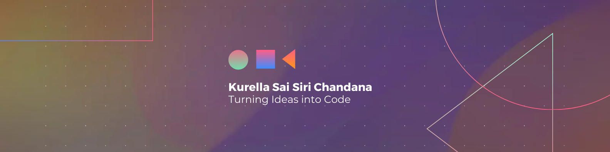

<div align="center">



[;Building+with+curiosity+and+coffee+☕)](https://git.io/typing-svg)

</div>

---

## 🌷 Tiny corner of the internet about me

```yaml
name: Kurella Sai Siri Chandana

currently:
  education: IT Undergraduate (2026)

debug_status:
  coffee: required ☕
  tabs_open: too_many
  mood: "git commit -m 'trusting the process'"

traits:
  - builds things from ideas and scribbles
  - curiosity driven
  - storyteller
  - documents everything
```

I build systems that begin as messy ideas and eventually become something useful.

Mostly exploring **AI systems, backend engineering, research, and practical problem-solving** — where curiosity starts the conversation and code finishes it.

---

## ✨ Things I've Been Crafting

<div align="center">

| Project | What it does | Tech |
|:---|:---|:---|
| 📈 **Haero – Portfolio Management System** | Full-stack portfolio management platform with real-time tracking, portfolio simulations, AI-powered risk insights, and intelligent market data handling | `React` `Spring Boot` `FastAPI` `Python` `MySQL` |
| 🧠 **[Inquira AI](https://github.com/SaiSiriChandana/Inquira-AI)** | AI-powered research assistant with PDF querying, contextual search, and citation-aware responses | `React` `FastAPI` `FAISS` `PyMuPDF` |
| 🎬 **[Context-Aware Fire TV Recommender](https://github.com/SaiSiriChandana/Amazon-HackOn-Season-5-2025)** | Adaptive recommendation system using mood, intent, weather and user context | `Flask` `AWS Comprehend` `Firebase` |
| 🔐 **Cryptographic Key Sharing via Hand Gesture Recognition** | Gesture-based authentication and secure encryption key exchange | `Python` `OpenCV` `MediaPipe` |
| 📊 **Azure Demand Forecasting System** | Predictive capacity optimization with ML-driven recommendations | `Python` `Flask` `React` |

</div>

---

## 💼 Experience

<div align="center">


| Experience | Key Contributions |
|:---|:---|
| **HSBC — Winter Intern** <br> *Jan 2026 – Jun 2026* | Built a Streamlit UI for a TM1Py-powered Dimension Compare Utility, automated reporting workflows, and worked with multidimensional systems & metadata management. |
| **Infosys Springboard Internship 6.0** <br> *Oct 2025 – Dec 2025* | Built an ML-powered Azure demand forecasting and capacity optimization system with prediction monitoring and optimization insights. |

</div>

---

## 🏆 Achievements & Certifications
<div align="center">
  
| Achievements | Certifications |
|:---|:---|
| **🥇 HSBC Hackathon 2025 Winner** | 📜 Oracle Cloud Infrastructure Generative AI Certified |
| **🚀 Amazon HackOn Season 5 — Top 130 among 15,000+ teams** | 📜 Artificial Intelligence Primer — Infosys Springboard |
| **🌟 GSSoC'24 Contributor** | 📜 Cambridge C1 English Certification | 

</div> 

---

## 🛠 Tech Stack

<div align="center">
  


 

            
          

</div>

---

## 📊 GitHub Universe

<p align="center">


</p>

---


## 🌱 Beyond Code ✨

- **NSS Coordinator** — Organized initiatives and coordinated activities, learning that leadership often starts with communication and consistency.
- 📝 Outside tech, I enjoy exploring ideas, documenting things, and turning random curiosity into tiny experiments. 

---

## 🌐 Socials:
Where to find me, follow along, or say hi 👋  

[](https://linkedin.com/in/kurella-sai-siri-chandana) [](https://medium.com/@sirichandoo.04) [](https://stackoverflow.com/users/24223319) [](https://x.com/sirichandana_k) [](https://codepen.io/k_sirichandana) [](https://bitbucket.org/sckworkspace/workspace/overview/)

---
<div align="center">
Turning curiosity into systems, one tiny experiment at a time.✨
</div>

---
